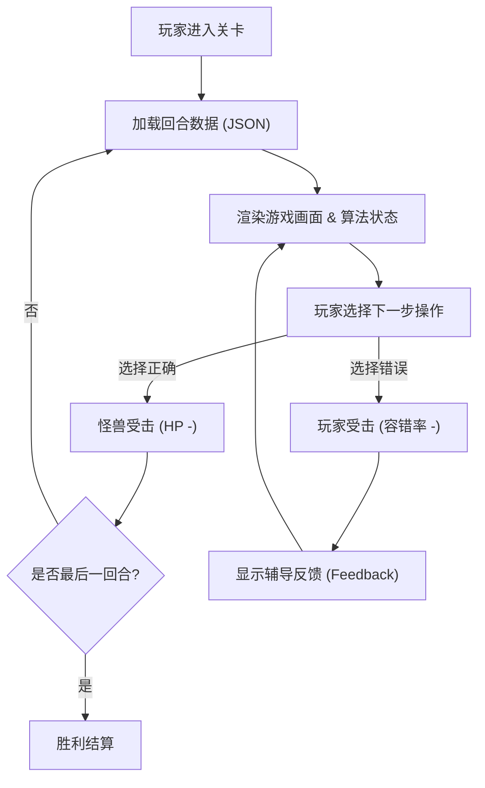

# 产品需求文档 (PRD)：Algorithm RPG Game (Web端)

## 1. 产品概述
将枯燥的“数据结构与算法”题目转化为 16-bit 像素风的回合制打怪 RPG 网页游戏。
- 目标用户是需要刷题的计算机专业学生、程序员。通过将解题过程拆解为状态预测的回合制战斗，提供趣味性极强的沉浸式学习体验，加深对算法底层逻辑的理解。

## 2. 核心功能

### 2.1 核心功能模块
1. **主游戏界面 (Game Arena)**：展示像素风勇士与题目 Boss（如链表魔龙）的对战动画及血条状态。
2. **算法可视化面板 (Algorithm Visualizer)**：动态渲染当前数据结构（数组、链表、树等）在内存中的状态。
3. **代码编辑器视图 (Code Editor)**：同步高亮当前执行到的算法伪代码/真实代码行。
4. **操作控制台 (Action Console)**：JRPG 风格的底部对话框，提供 AI 生成的下一步操作选项供玩家选择，并展示反馈（打字机特效）。

### 2.2 页面细节
| 页面名称 | 模块名称 | 功能描述 |
|-----------|-------------|---------------------|
| 主关卡页 (Home/Level) | 顶部状态栏 | 显示关卡名称、全局经验值、金币、当前时间复杂度（体力槽）。 |
| 主关卡页 | 左侧战斗区 | 纯黑背景，渲染环境图，左勇士右怪兽，附带浮动动画和受击抖动反馈。 |
| 主关卡页 | 右侧可视化区 | 用粗边框方块展示数据结构（如 `[1] -> [2] -> [3]`），标注指针位置。 |
| 主关卡页 | 右侧代码区 | 暗黑主题代码块，高亮显示当前回合对应的逻辑代码。 |
| 主关卡页 | 底部选项区 | 占满全宽的对话框，展示 AI 提问和 2-4 个巨型像素按钮选项。 |

## 3. 核心流程
1. 玩家进入页面，系统加载由 AI 预先生成的 JSON 关卡数据（包含多回合）。
2. 渲染第一回合：显示怪兽初始状态，更新数据可视化，抛出选项。
3. 玩家点击选项：
   - 若正确：播放攻击动画，怪兽扣血，进入下一回合。
   - 若错误：播放受击动画，玩家扣除容错血量，打字机输出错误反馈。
4. 步骤耗尽，怪兽血量归零：展示胜利结算界面。

## 4. 用户界面设计

### 4.1 设计风格 (Pixel Art & Retro Gaming)
- **主色调**: 深藏青 (`#0F172A`) 作为全局背景，亮白 (`#F8FAFC`) 为文字主色。
- **点缀色**: 霓虹绿 (`#39FF14`) 成功/高亮，像素红 (`#EF4444`) 危险/受击。
- **组件风格**: 所有的容器、按钮必须带有 2px-4px 的纯黑粗边框 (`border-black`)，并使用不带模糊的硬阴影 (`box-shadow: 4px 4px 0px #000000`)。圆角为 0 (`rounded-none`)。
- **字体**: 标题使用 `Press Start 2P`，正文和对话框使用 `VT323`，代码使用等宽字体。
- **素材来源**: 角色和怪兽使用已下载的像素图集，UI Icon 使用 RPG Awesome (或者粗边框化处理)。

### 4.2 响应式设计
- **优先宽屏 (Desktop-first)**: 因为需要并排展示战斗、数据可视化、代码、选项四个高信息密度区块。
- **Mobile 适配**: 手机端改为上下堆叠布局（战斗区缩半，隐藏代码区，仅保留核心的可视化和选项）。

### 4.3 动画与微动效
- **精灵图/悬浮**: 角色和怪兽的上下浮动。
- **硬核点击**: 按钮按下时向右下位移 2px，阴影减小，模拟物理按键。
- **打字机特效**: 底部对话框文本逐字输出。
