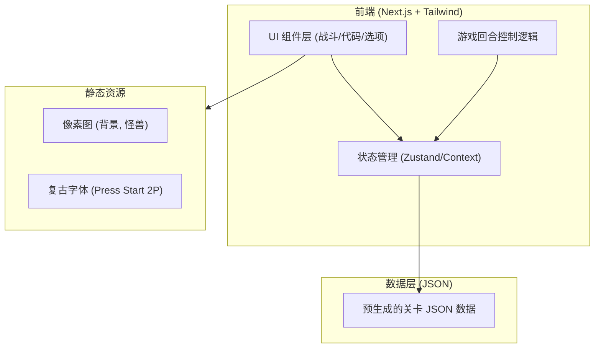

# 技术架构文档：Algorithm RPG Game (Web端)

## 1. 架构设计



## 2. 技术栈说明
- **框架**: `Next.js 14` (App Router) + `React 18`
- **样式**: `Tailwind CSS v3` (极度依赖自定义的配置来实现粗边框、硬阴影和霓虹色)。
- **状态管理**: 优先使用 React 内置 `useState`/`useReducer`。如果跨组件通信过于复杂，引入轻量级的 `Zustand`。
- **图标**: `lucide-react` (搭配 CSS stroke 调整为复古感) 或直接引入开源的 RPG 像素切图。
- **动画**: 纯 CSS 动画 (`@keyframes`) 处理角色悬浮、抖动；`framer-motion` (可选) 处理复杂的界面切换或打字机特效。
- **构建/初始化**: `npx create-next-app@latest`

## 3. 目录结构规划
```
src/
├── app/
│   ├── page.tsx           # 游戏主界面入口
│   ├── layout.tsx         # 全局布局 (引入字体)
│   └── globals.css        # 全局样式 (定义硬阴影, CSS变量)
├── components/
│   ├── game/
│   │   ├── Arena.tsx      # 战斗动画区 (背景+角色)
│   │   ├── Visualizer.tsx # 数据结构可视化区
│   │   ├── CodeEditor.tsx # 代码高亮区
│   │   └── Console.tsx    # 底部对话框与选项按钮
│   └── ui/
│       ├── PixelButton.tsx# 统一的像素风按钮组件
│       └── PixelCard.tsx  # 统一的像素风卡片容器
├── lib/
│   ├── levelData.ts       # 模拟后端的关卡 JSON 数据
│   └── gameEngine.ts      # 处理回合切换、扣血逻辑的 Hook
└── public/
    └── assets/
        └── images/        # 存放 bg_dungeon.png, boss_dragon.png 等
```

## 4. 核心组件状态接口 (Types)
```typescript
// 关卡数据类型定义
export interface Option {
  id: string;
  text: string;
  is_correct: boolean;
  damage: number;
  feedback: string;
}

export interface VisualState {
  reversed: number[];
  remaining: number[];
  prev: number | null;
  curr: number | null;
  next: number | null;
}

export interface Step {
  step_id: number;
  description: string;
  visual_state: VisualState;
  question: string;
  options: Option[];
}

export interface LevelData {
  monster_name: string;
  total_steps: number;
  steps: Step[];
}

// 游戏全局状态
export interface GameState {
  currentStepIndex: number;
  monsterHp: number;
  playerHp: number;
  dialogText: string;
  isAnimating: boolean;
}
```

## 5. 核心样式定制 (tailwind.config.ts 预想)
为了实现纯正的像素风，我们需要在 tailwind 中扩展一些特定的阴影和边框工具：
- `boxShadow: { 'pixel': '4px 4px 0px 0px rgba(0,0,0,1)', 'pixel-sm': '2px 2px 0px 0px rgba(0,0,0,1)' }`
- 主题颜色扩展：`bg-retro-dark`, `text-retro-green` 等。